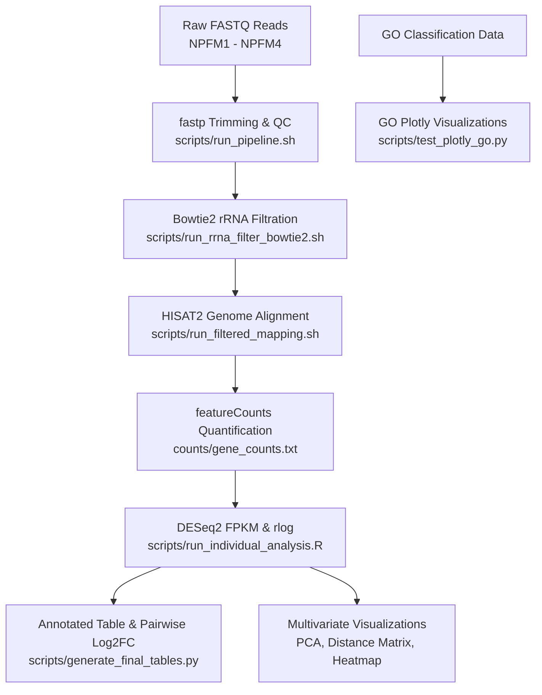

# MD Chakra Transcriptomic Analysis Pipeline

[](https://angsumi.github.io/MD-chakra/)
[](https://angsumi.github.io/MD-chakra/)
[]()
[]()

A comprehensive, reproducible RNA-Seq transcriptomic analysis pipeline and expression profiling workflow designed for 4 individual samples (**NPFM1**, **NPFM2**, **NPFM3**, **NPFM4**).

---

## 🔬 Project Overview & Experimental Context

* **Samples Analyzed:** 4 independent samples (`NPFM1`, `NPFM2`, `NPFM3`, `NPFM4`).
* **Experimental Design Note:** **No biological replicates and no experimental grouping (e.g., Control vs. Treatment).**
* **Analytical Strategy:** Rather than applying inappropriate two-group statistical hypothesis testing (such as grouped Wald tests or FDR thresholds), each sample is analyzed **independently**:
  1. Quantification of absolute gene and transcript counts.
  2. Library size and gene-length normalization using **FPKM** (Fragments Per Kilobase Million) via `DESeq2` (`design = ~1`).
  3. Variance stabilization using **regularized log transformation (`rlog`)**.
  4. Pairwise logarithmic fold-change (**log2FC**) calculation across all sample pairs.
  5. Sample-to-sample multivariate clustering via **PCA**, **Euclidean distance matrices**, and **Top 50 variable gene heatmaps**.
  6. Functional categorization via **Gene Ontology (GO) Classification**.

---

## 🌐 Live Web Portal & External Data

* 📊 **Interactive Web Portal:** [https://angsumi.github.io/MD-chakra/](https://angsumi.github.io/MD-chakra/)
* 💾 **External Raw Data Archive (FASTQ, BAM, Indexes):** [Google Drive Repository](https://drive.google.com/drive/folders/1s6HS42fGcSoCgNkTawVGfZ5nhJUsGWVX?usp=drive_link) *(Large files omitted from git to adhere to GitHub storage limits)*.

---

## 📁 Repository Directory Structure

```text
MD chakra/
├── bowtie2_logs/              # Alignment logs from Bowtie2 rRNA mapping for NPFM1-4
├── counts/                    # Raw and annotated gene/transcript count matrices
│   ├── gene_counts.txt        # Primary featureCounts output matrix
│   ├── gene_counts_with_names.csv  # Gene counts mapped with gene symbols
│   ├── NPFM{1..4}_transcript_counts.txt # Per-sample split transcript counts
│   ├── temp_counts_transcript.txt  # Transcript-level featureCounts output
│   └── total_counts_summary.csv    # Summary of total reads per feature/sample
├── docs/                      # Web application source for GitHub Pages
│   ├── assets/                # Web-served figures, tables, and downloadable deliverables
│   ├── index.html             # Responsive Glassmorphism portal UI
│   └── style.css              # Custom CSS styling
├── documents/                 # Project documentation and specifications
│   ├── PAper.pdf              # Reference manuscript/study
│   ├── reference_figures/     # Client figure references and target layouts
│   └── Transcriptomic_analysis_requirements.docx # Client deliverables requirements
├── downstream_results/        # Core analytical deliverable tables
│   ├── 6_FPKM_normalized_counts_individual.csv   # FPKM normalized counts
│   ├── 9_Annotated_Expression_Table_Individual.xlsx / .csv # Master annotated expression table
│   ├── 10_Pairwise_Comparisons.xlsx / .csv       # Pairwise Log2FC between all sample pairs
│   └── normalized_counts_rlog.csv                # DESeq2 rlog transformed counts
├── filtered_multiqc_report/   # MultiQC report for post-rRNA-filtration genome mapping
├── multiqc_report/            # MultiQC reports for initial fastp QC & HISAT2 mapping
├── new plots/                 # Modern interactive Plotly visualizations
│   ├── html/                  # Interactive HTML plots (zoomable, hoverable)
│   ├── pdf/                   # Vector PDF plots for publications
│   └── png/                   # High-resolution (300+ DPI) PNG images
├── old plots/                 # Historical exploratory plots, legacy MA plots, and drafts
├── processed_data/            # Processed tabular datasets and plotting inputs
│   ├── DESeq2_results.csv     # DESeq2 baseline result table
│   ├── Figure2_GO_Classification_Data.csv # GO term counts and percentages
│   ├── gene_annotation.csv    # Parsed GTF attributes (Gene ID, Chr, Name, Product)
│   ├── Table 1.csv            # Sequencing QC and gene expression statistics table
│   └── vst_normalized_counts.csv # VST normalized matrix
├── rrna_index/                # Bowtie2 index files for SortMeRNA rRNA database
├── scripts/                   # Complete suite of pipeline, analysis, and plotting scripts
├── visualizations/            # Final high-res publication figures (PDF & PNG)
├── AGY_CONTEXT.md             # Project memory and analytical configuration guide
└── README.md                  # Project documentation and provenance guide
```

---

## 🧩 Code Provenance Map: Which Code Produces What

Below is the complete reference mapping every script to its purpose, inputs, and generated outputs:

### 1. Upstream Pipeline & QC Scripts

| Script | Purpose & Function | Key Inputs | Primary Outputs Produced |
| :--- | :--- | :--- | :--- |
| [`scripts/run_pipeline.sh`](file:///home/angsuman/extra_spac/MD%20chakra/scripts/run_pipeline.sh) | Automated end-to-end upstream pipeline: fastp QC, HISAT2 alignment, SAMtools sorting/indexing, MultiQC, and featureCounts. | Raw FASTQs (`NPFM*_R{1,2}.fastq.gz`), `reference_index`, `annotation.gtf` | `fastp_qc/`, `alignments/*_sorted.bam`, `multiqc_report/`, `counts/gene_counts.txt` |
| [`scripts/run_rrna_filter_bowtie2.sh`](file:///home/angsuman/extra_spac/MD%20chakra/scripts/run_rrna_filter_bowtie2.sh) | Builds Bowtie2 rRNA database index and separates unmapped pure mRNA reads (`--un-conc-gz`). | `fastp_qc/*_trimmed_R*.fastq.gz`, `smr_v4.3_default_db.fasta` | `rrna_index/`, `rrna_filtered/*_mRNA_R*.fastq.gz`, `bowtie2_logs/*_rRNA_mapping.log` |
| [`scripts/run_rrna_filter.sh`](file:///home/angsuman/extra_spac/MD%20chakra/scripts/run_rrna_filter.sh) | SortMeRNA-based alternative rRNA extraction script. | Trimmed FASTQs | `rrna_filtered/` |
| [`scripts/run_filtered_mapping.sh`](file:///home/angsuman/extra_spac/MD%20chakra/scripts/run_filtered_mapping.sh) | Aligns rRNA-depleted mRNA reads back to reference genome with HISAT2 and builds post-filter MultiQC. | `rrna_filtered/*_mRNA_R*.fastq.gz`, `reference_index` | `filtered_alignments/*_filtered_sorted.bam`, `filtered_multiqc_report/` |
| [`scripts/resume_pipeline.sh`](file:///home/angsuman/extra_spac/MD%20chakra/scripts/resume_pipeline.sh) | Resumes alignment and quantification from existing trimmed fastq files. | `fastp_qc/` trimmed FASTQs | `alignments/`, `counts/gene_counts.txt` |
| [`scripts/recount_and_deseq2.sh`](file:///home/angsuman/extra_spac/MD%20chakra/scripts/recount_and_deseq2.sh) | Re-runs featureCounts with `-t gene -g gene_id` and executes DESeq2. | `annotation.gtf`, `alignments/*_sorted.bam` | `counts/gene_counts.txt` |
| [`scripts/run_eggnog_pipeline.sh`](file:///home/angsuman/extra_spac/MD%20chakra/scripts/run_eggnog_pipeline.sh) | Executes eggNOG-mapper for orthology assignment and functional annotation. | Protein FASTA | Functional annotations |

---

### 2. Downstream Analysis & Expression Profiling

| Script | Purpose & Function | Key Inputs | Primary Outputs Produced |
| :--- | :--- | :--- | :--- |
| [`scripts/run_individual_analysis.R`](file:///home/angsuman/extra_spac/MD%20chakra/scripts/run_individual_analysis.R) | Primary R pipeline for independent 4-sample profiling (`design = ~1`). Computes FPKM normalization, blind rlog counts, PCA, sample distance matrix, and top 50 variable genes heatmap. | `counts/gene_counts.txt` | `downstream_results/6_FPKM_normalized_counts_individual.csv`<br>`downstream_results/normalized_counts_rlog.csv`<br>`visualizations/7_PCA_plot_individual.{pdf,png}`<br>`visualizations/8_Sample_Distance_Matrix_individual.{pdf,png}`<br>`visualizations/11_Heatmap_Top50_Variable_individual.{pdf,png}` |
| [`scripts/generate_final_tables.py`](file:///home/angsuman/extra_spac/MD%20chakra/scripts/generate_final_tables.py) | Merges count matrices with GTF annotations; calculates Average Expression, Standard Deviation, and Z-scores per sample; computes pairwise log2FC across all sample combinations. | `counts/gene_counts.txt`<br>`processed_data/gene_annotation.csv`<br>`downstream_results/6_FPKM_normalized_counts_individual.csv` | `downstream_results/9_Annotated_Expression_Table_Individual.xlsx / .csv`<br>`downstream_results/10_Pairwise_Comparisons.xlsx / .csv` |
| [`scripts/normalize_counts.R`](file:///home/angsuman/extra_spac/MD%20chakra/scripts/normalize_counts.R) | Applies DESeq2 VST transformation. | `counts/gene_counts.txt` | `processed_data/vst_normalized_counts.csv` |
| [`scripts/run_deseq2.R`](file:///home/angsuman/extra_spac/MD%20chakra/scripts/run_deseq2.R) | Legacy DESeq2 differential expression script (historical baseline). | `counts/gene_counts.txt` | `processed_data/DESeq2_results.csv` |
| [`scripts/run_gsea_human_orthologs.R`](file:///home/angsuman/extra_spac/MD%20chakra/scripts/run_gsea_human_orthologs.R) | Maps spider gene symbols to human orthologs for clusterProfiler GSEA. | `downstream_results/10_Annotated_DESeq2_results.csv`, `annotation.gtf` | `downstream_results/GSEA/` |

---

### 3. Parsing, Formatting & Summary Statistics

| Script | Purpose & Function | Key Inputs | Primary Outputs Produced |
| :--- | :--- | :--- | :--- |
| [`scripts/parse_gtf.py`](file:///home/angsuman/extra_spac/MD%20chakra/scripts/parse_gtf.py) | Parses GTF file to extract `Gene ID`, `Chromosome`, `Gene Name`, and `Description` (product). | `reference_genome/annotation.gtf` | `processed_data/gene_annotation.csv` |
| [`scripts/add_gene_names.py`](file:///home/angsuman/extra_spac/MD%20chakra/scripts/add_gene_names.py) | Direct mapping of gene symbols onto raw count matrix. | `reference_genome/annotation.gtf`, `counts/gene_counts.txt` | `counts/gene_counts_with_names.csv / .xlsx` |
| [`scripts/parse_fastp.py`](file:///home/angsuman/extra_spac/MD%20chakra/scripts/parse_fastp.py) | Extracts Clean Bases, Total Read Pairs, Q30%, and GC% from fastp JSON logs. | `fastp_qc/*_fastp_report.json` | Formatted Table 1 summary in stdout |
| [`scripts/split_transcript_counts.py`](file:///home/angsuman/extra_spac/MD%20chakra/scripts/split_transcript_counts.py) | Splits multi-sample transcript counts into individual sample files. | `counts/temp_counts_transcript.txt` | `counts/NPFM{1..4}_transcript_counts.txt` |
| [`scripts/calculate_totals.py`](file:///home/angsuman/extra_spac/MD%20chakra/scripts/calculate_totals.py) | Computes total transcript and total gene count sums across samples. | `counts/gene_counts.txt`, `counts/temp_counts_transcript.txt` | `counts/total_counts_summary.csv` |
| [`scripts/calc_expressed_stats.py`](file:///home/angsuman/extra_spac/MD%20chakra/scripts/calc_expressed_stats.py) | Calculates total expressed unigenes, total length, N50 length, and mean lengths. | `counts/temp_counts_gene.txt` | Formatted assembly/expression statistics |
| [`scripts/calc_n50.py`](file:///home/angsuman/extra_spac/MD%20chakra/scripts/calc_n50.py) | Calculates N50 and sequence metrics from FASTA transcripts. | Transcript FASTA | N50 metrics |
| [`scripts/count_transcripts.py`](file:///home/angsuman/extra_spac/MD%20chakra/scripts/count_transcripts.py) | Counts total transcript lines in GTF. | `reference_genome/annotation.gtf` | Transcript counts |
| [`scripts/gtf_to_bed.py`](file:///home/angsuman/extra_spac/MD%20chakra/scripts/gtf_to_bed.py) | Converts GTF annotation into BED format. | `reference_genome/annotation.gtf` | BED file |

---

### 4. Visualization & Plotting Scripts

| Script | Purpose & Function | Key Inputs | Primary Outputs Produced |
| :--- | :--- | :--- | :--- |
| [`scripts/generate_plotly_graphs.py`](file:///home/angsuman/extra_spac/MD%20chakra/scripts/generate_plotly_graphs.py) | Generates interactive and publication figures (HTML, PDF, PNG) for Table 1 stats, GO classification, PCA, distance matrix, and heatmap. | `processed_data/Table 1.csv`<br>`processed_data/Figure2_GO_Classification_Data.csv`<br>`downstream_results/normalized_counts_rlog.csv` | `new plots/html/*.html`<br>`new plots/pdf/*.pdf`<br>`new plots/png/*.png` |
| [`scripts/test_plotly_go.py`](file:///home/angsuman/extra_spac/MD%20chakra/scripts/test_plotly_go.py) | Custom Plotly script for dual-axis Gene Ontology Classification plot with log-scale gene percentages and ontology brackets. | `processed_data/Figure2_GO_Classification_Data.csv` | `visualizations/GO_Classification_with_ontology_labels.png`<br>`visualizations/GO_Classification_without_ontology_labels.png` |
| [`scripts/plot_go_figure2.py`](file:///home/angsuman/extra_spac/MD%20chakra/scripts/plot_go_figure2.py) | Matplotlib / Seaborn generation of GO Classification figure. | `processed_data/Figure2_GO_Classification_Data.csv` | `old plots/Figure2_GO_Classification.png` |
| [`scripts/plot_go_paper_style.py`](file:///home/angsuman/extra_spac/MD%20chakra/scripts/plot_go_paper_style.py) | Paper-style GO Classification plot matching reference publication typography. | `processed_data/Figure2_GO_Classification_Data.csv` | `old plots/Figure2_GO_Classification_PaperStyle.png` |
| [`scripts/generate_go_figure2.R`](file:///home/angsuman/extra_spac/MD%20chakra/scripts/generate_go_figure2.R) | ggplot2 R script for Figure 2 GO classification. | `processed_data/Figure2_GO_Classification_Data.csv` | `Figure2_GO_Classification.pdf` |
| [`scripts/generate_plot_modern.py`](file:///home/angsuman/extra_spac/MD%20chakra/scripts/generate_plot_modern.py) | Modernized styled plots for Table 1 statistics and exploratory metrics. | `processed_data/Table 1.csv` | `old plots/table 1 plot_modern.{png,pdf}` |
| [`scripts/fix_table1_plot.py`](file:///home/angsuman/extra_spac/MD%20chakra/scripts/fix_table1_plot.py) | Clean grid rendering for Table 1 bar charts. | `processed_data/Table 1.csv` | `old plots/table 1 plot.{png,pdf}` |

---

## 🚀 Step-by-Step Execution Walkthrough



### Step 1: Quality Control & Trimming
Run `fastp` on all paired-end raw FASTQ files to trim adapters, low-quality tails (Q < 20), and filter reads:
```bash
bash scripts/run_pipeline.sh
```

### Step 2: Ribosomal RNA (rRNA) Depletion
Download SortMeRNA database, index it with Bowtie2, and filter out non-mRNA reads:
```bash
bash scripts/run_rrna_filter_bowtie2.sh
```

### Step 3: Genome Alignment & Filtered QC
Align rRNA-filtered reads to the reference genome using `HISAT2` and aggregate stats via `MultiQC`:
```bash
bash scripts/run_filtered_mapping.sh
```

### Step 4: Gene & Transcript Level Quantification
Count reads mapping to genomic features using `featureCounts`:
```bash
featureCounts -T 12 -p -t gene -g gene_id -a annotation.gtf -o counts/gene_counts.txt filtered_alignments/*_filtered_sorted.bam
```

### Step 5: Independent Normalization & Exploratory Analysis
Execute the R analysis script to obtain FPKM normalized counts, blind rlog counts, PCA, and distance matrices:
```bash
Rscript scripts/run_individual_analysis.R
```

### Step 6: Annotation Merging & Pairwise Comparison Matrix
Merge counts with parsed GTF attributes and compute all pairwise fold-changes:
```bash
python3 scripts/parse_gtf.py
python3 scripts/generate_final_tables.py
```

### Step 7: Visualizations & Web Deployment
Generate interactive and publication-ready Plotly graphics:
```bash
python3 scripts/generate_plotly_graphs.py
python3 scripts/test_plotly_go.py
```

---

## 📊 Core Deliverables Summary

| Deliverable Name | File Path | Description |
| :--- | :--- | :--- |
| **Annotated Expression Table** | [`downstream_results/9_Annotated_Expression_Table_Individual.xlsx`](file:///home/angsuman/extra_spac/MD%20chakra/downstream_results/9_Annotated_Expression_Table_Individual.xlsx) | Master matrix: Gene ID, Chr, Gene Name, Description, individual sample FPKM, Average Expression, StdDev, and Z-scores. |
| **Pairwise Comparisons Table** | [`downstream_results/10_Pairwise_Comparisons.xlsx`](file:///home/angsuman/extra_spac/MD%20chakra/downstream_results/10_Pairwise_Comparisons.xlsx) | Pairwise log2FC computed across all 6 combinations of the 4 samples based on normalized FPKM. |
| **FPKM Normalized Matrix** | [`downstream_results/6_FPKM_normalized_counts_individual.csv`](file:///home/angsuman/extra_spac/MD%20chakra/downstream_results/6_FPKM_normalized_counts_individual.csv) | Depth- and gene length-normalized expression values for all 4 samples. |
| **PCA Clustering Plot** | [`visualizations/7_PCA_plot_individual.png`](file:///home/angsuman/extra_spac/MD%20chakra/visualizations/7_PCA_plot_individual.png) | 2D Principal Component Analysis based on rlog counts displaying sample separation. |
| **Sample Distance Matrix** | [`visualizations/8_Sample_Distance_Matrix_individual.png`](file:///home/angsuman/extra_spac/MD%20chakra/visualizations/8_Sample_Distance_Matrix_individual.png) | Euclidean distance heatmap with hierarchical clustering. |
| **Top 50 Variable Genes Table** | [`downstream_results/Top_50_Variable_Genes_Annotated.xlsx`](file:///home/angsuman/extra_spac/MD%20chakra/downstream_results/Top_50_Variable_Genes_Annotated.xlsx) | Dedicated table of the 50 most variable genes across samples with variance, standard deviation, and Z-scores. |
| **Top 50 & 100 Highly Expressed Genes** | [`downstream_results/Top_50_Highly_Expressed_Genes.xlsx`](file:///home/angsuman/extra_spac/MD%20chakra/downstream_results/Top_50_Highly_Expressed_Genes.xlsx) | Annotated tables of the top 50 and top 100 highest expressing genes ranked by mean FPKM expression. |
| **Top 50 Variable Heatmap** | [`visualizations/11_Heatmap_Top50_Variable_individual.png`](file:///home/angsuman/extra_spac/MD%20chakra/visualizations/11_Heatmap_Top50_Variable_individual.png) | Row Z-score normalized heatmap for the 50 most variable genes across samples. |
| **Expression Distribution Boxplot** | [`visualizations/12_Expression_Distribution_Boxplot.png`](file:///home/angsuman/extra_spac/MD%20chakra/visualizations/12_Expression_Distribution_Boxplot.png) | Log2-expression violin and boxplot showing comparable medians and dynamic ranges across all samples. |
| **Expression Density Curves (KDE)** | [`visualizations/13_Expression_Density_Plot.png`](file:///home/angsuman/extra_spac/MD%20chakra/visualizations/13_Expression_Density_Plot.png) | Kernel Density Estimation showing global distribution concordance across NPFM1–NPFM4. |
| **Cumulative CPM Read Distribution** | [`visualizations/14_Cumulative_CPM_Distribution.png`](file:///home/angsuman/extra_spac/MD%20chakra/visualizations/14_Cumulative_CPM_Distribution.png) | Cumulative read percentage curve across ranked unigenes assessing library complexity. |
| **GO Classification Plot** | [`visualizations/GO_Classification_with_ontology_labels.png`](file:///home/angsuman/extra_spac/MD%20chakra/visualizations/GO_Classification_with_ontology_labels.png) | Gene Ontology classification bar chart categorized by BP, CC, and MF. |


---

## 💻 Tech Stack & Dependencies

* **Linux Environment:** Ubuntu / Debian x86_64
* **Bioinformatics Tools:** `fastp` (v0.23+), `Bowtie2` (v2.5+), `HISAT2` (v2.2+), `SAMtools` (v1.16+), `Subread featureCounts` (v2.0+), `MultiQC` (v1.14+)
* **R Packages (4.x):** `DESeq2`, `pheatmap`, `RColorBrewer`, `ggplot2`, `ggrepel`
* **Python Packages (3.10+):** `pandas`, `numpy`, `plotly`, `scikit-learn`, `scipy`, `openpyxl`, `kaleido`
